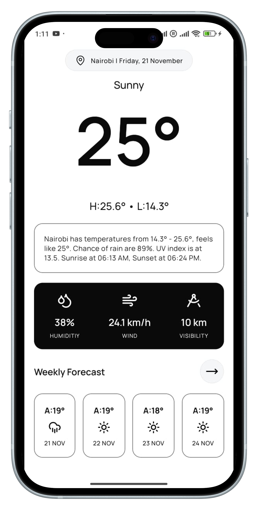
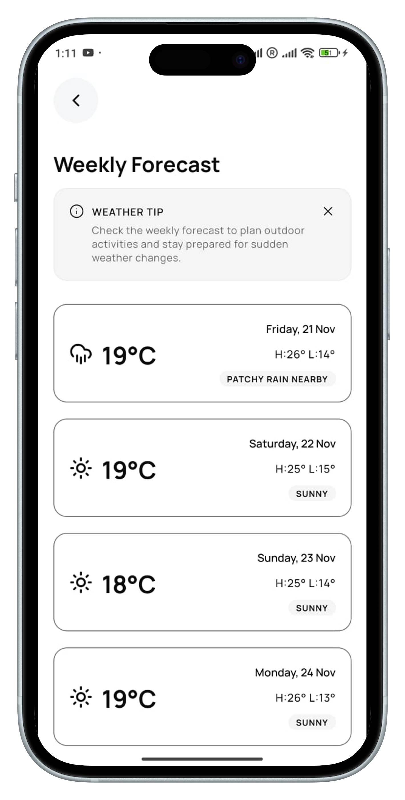

# Weathr-Sense 🌤️
Weathr-Sense is a React Native mobile application that provides detailed weather forecasts for locations in Kenya. Users can select counties, view current weather conditions, humidity, wind, visibility, and a weekly forecast with temperature trends. The app leverages modern UI components, bottom sheets, and state management for a smooth, interactive experience.

## Features
- Current Weather: Displays temperature, weather conditions, and feels-like temperature.
- Humidity, Wind & Visibility: Shows key weather stats in an intuitive card layout.
- Weekly Forecast: Provides a four-day forecast with temperature highs/lows and weather icons.
- County Selection: Select any county from Kenya using a searchable bottom sheet modal.
- Pull-to-Refresh: Refresh the weather data by pulling down on the main screen.
- Dark & Light Mode Support: Adapts automatically to system theme.
- Offline Fallback: Graceful error handling when data cannot be fetched.
- Interactive UI: Fast refresh and smooth navigation between screens.

## Get Started
Prerequisites: Make sure you have completed the React Native Environment Setup
before proceeding.

### Step 1: Install Dependencies
```bash
# Using npm
npm install

# OR using Yarn
yarn install
```

### Step 2: Start Metro
Metro is the JavaScript bundler that serves your app to the emulator/device.

```bash
npm start
# or
yarn start
```
### Step 3: Run the App
#### Android
```bash
npm run android
# or
yarn android
```

#### IOS
```bash
# Install CocoaPods if not already
bundle install
bundle exec pod install

npm run ios
# or
yarn ios
```

### Step 4: Use the App
- Tap the MapPin badge to open the county selector bottom sheet.
- Select a county to view its current weather and weekly forecast.
- Pull down to refresh the weather data.
- Navigate to the weekly forecast for a more detailed outlook.

### Running Tests
Weathr-Sense uses Jest for testing. Some native modules like react-native-gesture-handler and @gorhom/bottom-sheet are mocked to run tests in a Node environment.

```bash
# Run all tests
npm test
# or
yarn test 
```

### Mocking Native Modules for Tests
In __mocks__/:

- react-native-gesture-handler.js
- @gorhom/bottom-sheet.js

These allow tests to run without requiring native binaries.

### Technologies Used
- React Native 0.82.1
- TypeScript
- Zustand (state management)
- @gorhom/bottom-sheet (bottom sheet modals)
- React Navigation (navigation)
- Lucide Icons (icons)
- Jest (testing)
- React Query (data fetching)

### Screenshots



### Troubleshooting
- Metro not starting: Kill existing metro processes: npx react-native start --reset-cache.
- iOS build fails: Make sure you have installed pods: cd ios && pod install.
- Test errors with native modules: Ensure mocks are in __mocks__/ and moduleNameMapper is configured in jest.config.js.